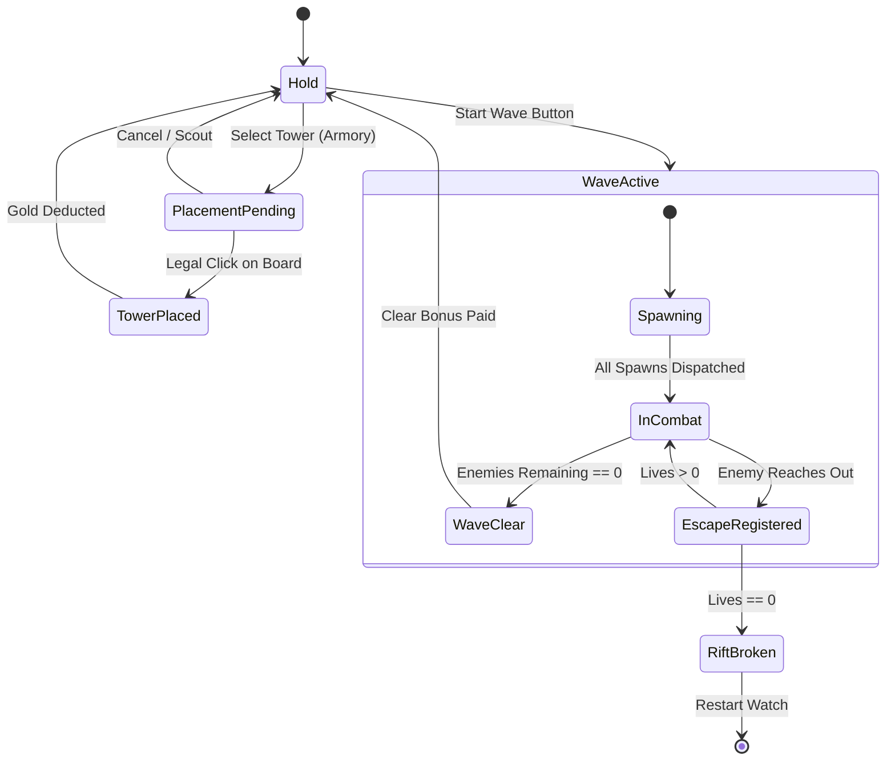

# Game Experience & Flow Specification Template

Use this template when producing game experience, player loop, and UX flow specifications for Citadel Watch.

---

# [System / Feature Name] Experience & Flow Specification

**Role**: Game Experience Director & UX Flow Architect  
**Status**: Draft / Proposed / Approved  
**Seam Impact**: [Simulation (`src/game/sim/`, `src/game/systems/`) | HUD (`src/components/`, `src/game/hud/`) | 3D View (`src/game/world3d/`)]

---

## 1. Executive Summary & Player Goals

- **Objective**: What does the player achieve, and why does this experience exist?
- **Player Motivation**: Challenge, tactical mastery, survival tension, or campaign progression.
- **Friction Solved**: What current player confusion, silent failure, or cognitive overload is eliminated?

---

## 2. Loop Architecture

### 2.1 Micro Loop (Seconds)
- **Trigger**: [e.g., Enemy enters Range]
- **Action**: [e.g., Tower fires projectile, audio stinger plays]
- **Feedback**: [e.g., Impact particle, damage floating text, combo timer increments]

### 2.2 Session Loop (Minutes)
- **Hold Phase**: Scout board, inspect road, place/relocate towers, spend starting gold.
- **Wave Active**: Trigger wave arrival, monitor creeps/runners/bosses, adapt to escapes.
- **Resolution**: Clear bonus paid, combo reward settled, advance to next wave or Rift Broken.

### 2.3 Meta Loop (Hours / Campaign)
- **Milestones**: Complete Campaign (waves 1-20), unlock advanced layouts, record high scores.

---

## 3. Flow Architecture & State Machine

### 3.1 State Transitions

| From State | Event / Input | Guard / Condition | To State | Action / Visual & Audio Feedback |
|---|---|---|---|---|
| `Hold` | Tap "Start Wave" | `canStartWave == true` | `WaveActive` | Arrive enemies, disable layout change, toast wave name |
| `Scout` | Click Tower in Armory | `Gold >= Cost` | `PlacementPending` | Display ghost preview with range aura |
| `PlacementPending` | Click Board point | `validatePlacement() == true` | `Scout` | Deduct gold, spawn tower mesh, play placement audio |
| `PlacementPending` | Click Board point | `validatePlacement() == false` | `PlacementPending` | Red placement aura, shake ghost, error audio tone |

### 3.2 Flow Diagram (Mermaid)

---

## 4. Interaction & Feedback Matrix

| Modality | Action / Gesture | System Response | HUD / Audio Feedback | Error State / Guard |
|---|---|---|---|---|
| Mouse | Hover Armory item | Show stats preview | Tooltip with damage/range/cost | Grayed out if `Gold < Cost` |
| Mouse | Drag Placed Tower | Initiate Relocate preview | Green ghost circle on legal point | Red circle if point conflicts with road |
| Touch | Tap Tower (<= 16px slop)| Select tower | Open SelectionPanel (Upgrade/Sell) | Deselects if tap on empty ground |
| Touch | Drag (> 16px slop) | Pan camera view | Smooth canvas pan | Clamped to board boundary |
| Keyboard | Spacebar | Toggle Pause / Resume | Toast status update | Disabled during Rift Broken |

---

## 5. HUD Information Hierarchy & Layout Zones

- **Zone 1 (Top / Immediate Status)**: Gold, Lives, Wave / Campaign index, Score, Combo counter.
- **Zone 2 (Side / Command Rack)**: Armory (Hex Gun, Mortar Post, Rail Sniper, Ward Beacon, Frost Lantern), Scout stance toggle.
- **Zone 3 (Contextual / Selection Drawer)**: Selected tower level, stats, Upgrade cost, Sell refund.
- **Zone 4 (Global Utility)**: Speed toggle (1x-5x), Sound mute, Reduced motion, Layout selection.

---

## 6. Economy Flow (Machinations Model)

- **Sources**: Starting Gold (`STARTING_GOLD`), Enemy Kill Rewards (`KIND_TRAITS`), Wave Clear Bonus (`CLEAR_BONUS`).
- **Pools**: Citadel Gold, Citadel Lives (default `STARTING_LIVES`).
- **Converters**: Tower Purchase (`Spent += Cost`), Upgrade (`Spent += UpgradeCost`), Sell (`Refund = Spent * REFUND_RATE`).
- **Sinks**: Escapes (Ordinary: -1 Life; Colossus: -2 Lives; Overlord: -3 Lives), Unrecovered sell margin.

---

## 7. Tuning Hypotheses & Validation Gates

All parameters are explicit testable hypotheses:

| Parameter | Hypothesized Target | Expected Behavior | Verification Metric |
|---|---|---|---|
| Wave 1-3 Gold Inflow | Sufficient for 2 Hex Guns | Player never forced into 0-tower wave 1 | 100% of standard plays start wave with >= 2 towers |
| Frost Lantern Slow | 35% speed reduction | Groups enemies for Mortar Post splash | Mortar Post damage efficiency increases >= 25% |
| Relocate Gesture Slop | 16px screen slop / 48 logical units | Zero accidental relocations during tap | Less than 1% accidental moves on coarse touch |

---

## 8. Quality & Finish-Gate Review

- [ ] Strict terminology match against `CONTEXT.md`
- [ ] No game state held inside Three.js or React layers
- [ ] Touch targets >= 44px
- [ ] Accessible color contrast and reduced motion support
- [ ] Zero silent failures
