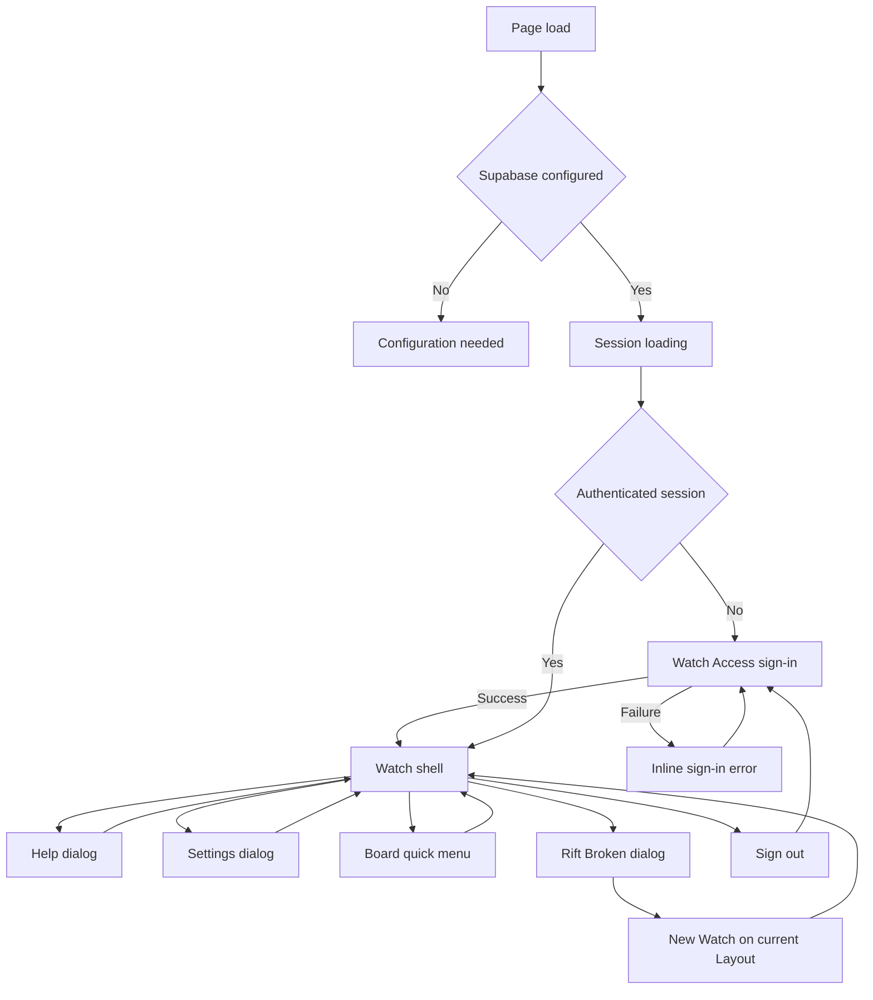
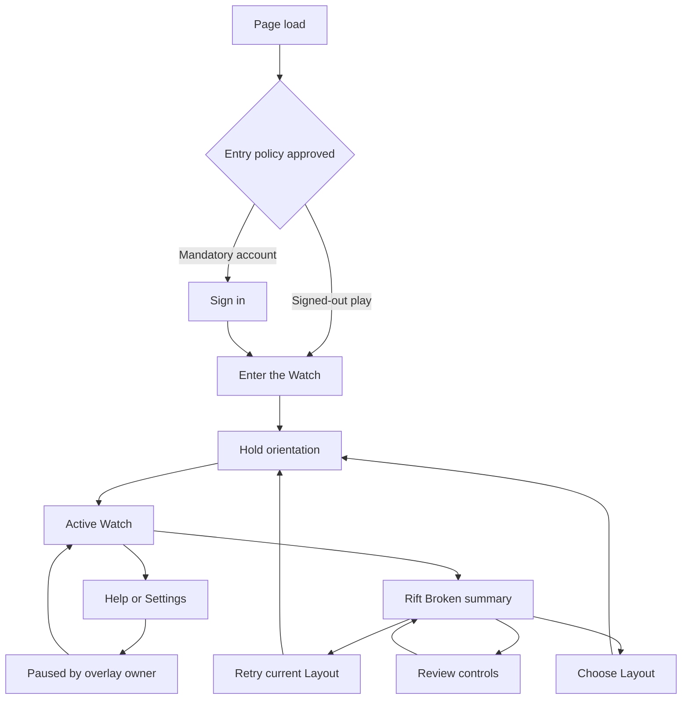
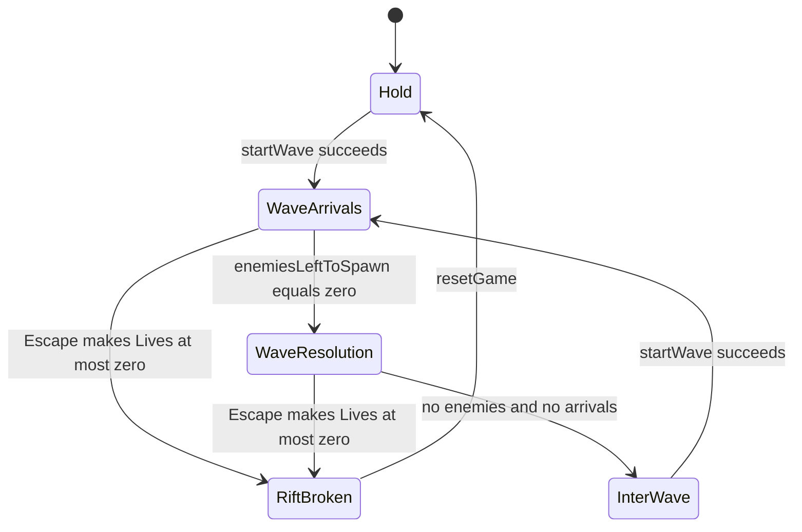
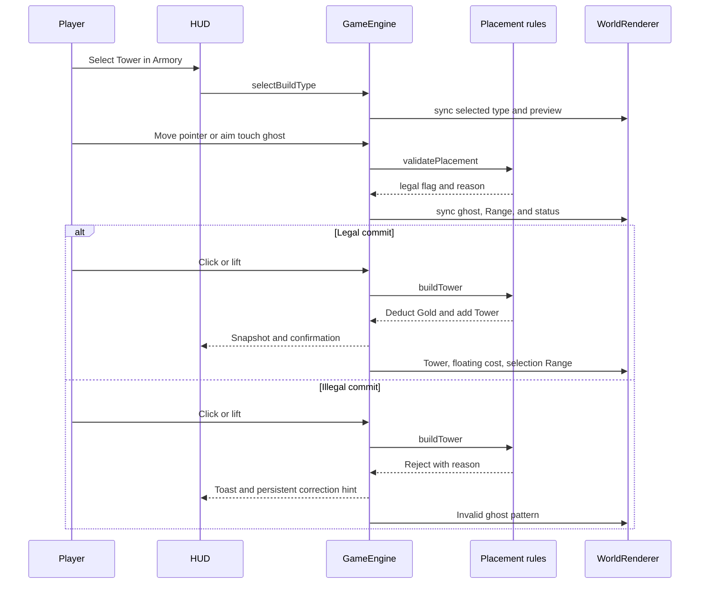
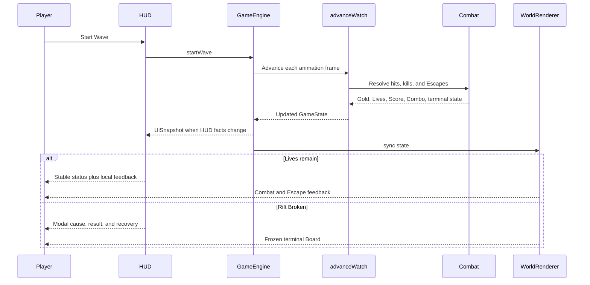
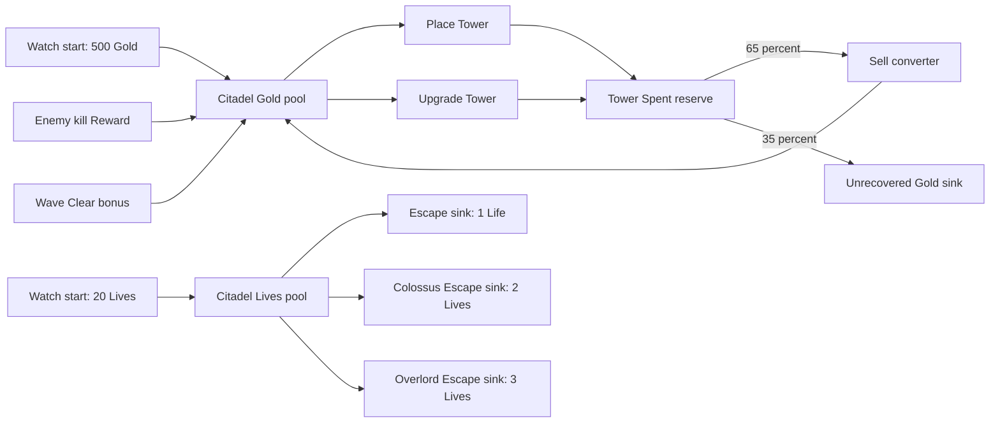

# First Watch Experience & Flow Specification

**Role:** Game Experience Director, Action Producer, Game UX Flow Architect, and Finish-Gate Reviewer

**Status:** Draft proposal for review

**Date:** 2026-09-17

**Target flow:** Entry, Hold, Waves, Rift Broken, and recovery

**Seam impact if approved:** Simulation (`src/game/sim/`, `src/game/systems/`), HUD (`src/components/`, `src/game/hud/`), 3D view (`src/game/world3d/`), and live adapter (`src/game/GameEngine.ts`)

**Implementation status:** Specification only. No application or Figma changes are authorized.

## Decision legend

- **Current:** Verified behavior in the repository.
- **Proposal:** Recommended behavior that does not exist yet.
- **Hypothesis:** A proposal that must pass the stated measurement and falsification gate.
- **Decision required:** Product choice needed before Figma or implementation.

## 1. Executive summary and player goals

### 1.1 Objective

The first Watch must teach one complete cause-and-effect loop without stopping combat for a tutorial treadmill:

1. Enter the Board.
2. Understand that the Citadel has Lives and enemies travel from In to Out.
3. Select a Tower from the Armory.
4. place it on legal ground during Hold.
5. Start the first Wave.
6. Read target, hit, kill Reward, Escape, and Clear bonus feedback.
7. Adapt between and during Waves.
8. Understand Rift Broken.
9. Start a new Watch with a clear recovery choice.

The first Watch succeeds as an experience when the player can explain why Gold changed, why Lives changed, what action starts the next Wave, and what to try after Rift Broken.

### 1.2 Player motivation

- **Immediate:** Defend the Citadel and watch a chosen Tower affect enemies on the Road.
- **Watch-length:** Budget Gold, improve placement, and survive increasingly varied Waves.
- **Campaign-length:** Complete the first twenty named Waves and improve personal mastery.
- **Long-term:** Compare Layout strategies and personal Scores. Durable records are not current behavior.

### 1.3 Primary audit finding

Core rules are coherent and well separated, but the first-Watch experience does not yet expose that coherence:

- Hold is a large clickable status label, not a visible “Start Wave” instruction.
- Initial guidance teaches camera movement but omits the first required combat actions.
- The HUD has enemy counts in `UiSnapshot` but does not display Wave progress.
- Placement legality has a simulation reason, but the ghost communicates only by color until the player commits an invalid action.
- Help and Settings are modal while the Watch continues running.
- Rift Broken freezes on the next frame, offers only “New Watch,” and does not explain the decisive Escape.
- The current tick can continue combat after `gameOver` becomes true during that same tick.
- Wave 20 has no completion milestone; Wave 21 displays against a fixed `/ 20` Campaign count.
- Current mandatory Supabase entry conflicts with the signed-out play direction in `docs/adr/0004-vercel-auth-and-data.md`.

### 1.4 Scope and non-goals

This specification covers the full first-Watch journey and its feedback architecture. It does not:

- change Tower, enemy, Wave, or economy values;
- add unlocks, quests, or a durable progression system;
- redesign application visuals;
- change source code;
- modify Figma before approval;
- treat proposed mechanics as current facts.

## 2. Grounding and current-state evidence

### 2.1 Repository evidence

| Area | Current evidence | Experience consequence |
| --- | --- | --- |
| Domain | `CONTEXT.md` defines Watch, Board, Road, In, Out, Citadel, Armory, Tower, Scout, Wave, Campaign, Hold, Rift Broken, Gold, Lives, Reward, Clear bonus, Spent, Refund, and Score. | All player-facing language in this specification uses those terms. |
| Architecture | `docs/ARCHITECTURE.md` and ADRs 0001–0003 keep rules in the headless simulation, HUD behind `UiSnapshot` and `HudCommands`, and Three.js as a view. | Future work must preserve seam ownership. |
| Entry | `AuthGate` in `src/auth/AuthGate.tsx` requires configured Supabase and an authenticated session, except for development `?skipAuth`. `LoginScreen` exposes email/password entry. | Production players cannot reach a first Watch while signed out. |
| Entry contradiction | `docs/adr/0004-vercel-auth-and-data.md` is proposed, says play stays signed out, and specifies Clerk later. Current source uses mandatory Supabase. | Entry policy must be resolved before Figma establishes a canonical journey. |
| Initial state | `createInitialState` in `src/game/state/createInitialState.ts` creates Serpentine, 500 Gold, 20 Lives, Wave 0, Speed 1x, Scout, and no Towers. | Hold starts with broad build choice and no required starter Tower. |
| Initial guidance | `GameEngine` constructs the Watch and shows “Scout: drag to pan. Pinch or use + / − to zoom.” A reset instead says “New Watch. Place a tower, then start the Wave.” | First entry gives less task guidance than recovery. |
| Hold control | `statusLabel` and `onStatus` in `src/components/Header.tsx` render `HOLD` or `NEXT`; clicking starts a Wave when `canStartWave` is true. The accessible name says “Start wave.” | Screen-reader intent is clearer than visible intent. |
| Wave eligibility | `canStartWave` in `src/game/systems/waves.ts` requires no Rift Broken, no active Wave, and no enemies. It does not require a Tower. | A new player can start Wave 1 with no defense and no warning. |
| Tick order | `advanceWatch` in `src/game/sim/advanceWatch.ts` updates FX, arrivals, enemies and Escapes, Towers, projectiles, entities, Wave clear, then preview. | Rules are deterministic by phase, except terminal state is checked only at tick entry. |
| Arrivals and clear | `startWave`, `updateWaveSpawner`, and `checkWaveCleared` in `src/game/systems/waves.ts` own Wave count, named plan, arrivals, and Clear bonus. | A Wave clears when no enemies and no arrivals remain, whether enemies were killed or escaped, unless Rift Broken occurred. |
| Combat | `applyDamage` and `resolveEscape` in `src/game/systems/combat.ts` own Reward, Score, Combo, Lives loss, and Rift Broken. | Kill and Escape truth stays in simulation. |
| Economy | `TOWER_TYPES` in `src/game/constants.ts`, `getUpgradeCost` in `src/game/config/towerStats.ts`, and sell functions in `src/game/systems/upgrade.ts` define costs, Spent, and 65% Refund. | Gold flow is traceable; Lives have no recovery source. |
| Placement | `validatePlacement` in `src/game/systems/placement.ts` checks Board bounds, Gold, Road clearance, and Tower spacing. `computePlacementPreview` in `src/game/sim/preview.ts` preserves the failure reason. | Legality is centralized, but the HUD does not receive the preview reason. |
| Input | `ScreenPointerHub` in `src/game/sim/screenPointer.ts` distinguishes tap, pan, touch aim, pinch, long-press, and Board interaction. `pointer.ts` distinguishes select from relocate. | Pointer intent is strong and covered by headless tests. |
| HUD truth | `buildUiSnapshot` in `src/game/hud/snapshot.ts` exposes Wave activity, enemy count, arrivals remaining, affordability, interaction mode, Layout, reduced motion, and selection. | Several useful first-Watch facts already cross the HUD seam but remain undisplayed. |
| World feedback | `WorldRenderer.sync` mirrors state. `syncGhost` uses teal for legal and orange for illegal placement; selection rings, health bars, Slow emissive, projectiles, particles, floating text, and shake reflect simulation. | Combat reads visually, but invalid placement relies on color and no visible reason. |
| Audio | `AudioEngine.play` has shoot, hit, kill, build, upgrade, sell, Wave, clear, life, and lose cues. `SoundName` has no invalid-action cue. | Success and combat have cues; invalid action does not. |
| Rift Broken | `breakRift` sets `gameOver` and plays lose once. `GameOverOverlay` shows Score, completed Waves, Kills, and “New Watch.” | Terminal feedback is concise but gives no cause, learning prompt, or alternate recovery. |
| Recovery | `resetGame` calls `resetState` with the current Layout. It preserves mute and reduced-motion settings, resets Speed to 1x, and does not reset the camera. | Recovery is immediate but implicit about what is preserved. |
| Campaign | `CAMPAIGN_WAVES` is 20. `getWavePlan` continues cyclic Waves after 20. `StatsPanel` always formats current Wave as `wave / 20`. | There is no Campaign completion moment; Wave 21 can appear as `21 / 20`. |
| Accessibility | `App` has a skip link; canvas is focusable; dialogs and live regions are used; focus-visible styles exist; coarse targets use 44px; reduced motion and reduced transparency are supported. | Strong base, but keyboard-only Board placement and non-color ghost status are missing. |
| Persistence | `useGameEngine` creates in-memory state on mount. No save/load or current record store exists. | Refresh, sign-out, and remount discard the Watch. |

### 2.2 Current numeric baseline

These values are facts, not recommendations:

- Starting Gold: 500.
- Starting Lives: 20.
- Speed: 1x, selectable through 5x.
- Campaign: 20 named Waves, followed by scaled reuse.
- Maximum Tower Level: 10.
- Tower costs: Hex Gun 100, Mortar Post 210, Rail Sniper 280, Ward Beacon 180, Frost Lantern 160.
- Upgrade cost: `round(base Tower cost × 0.78 × current Level)`.
- Refund: `round(Spent × 0.65)`.
- Clear bonus: `35 + Wave × 7 + 80 when the Wave plan has a boss`.
- Escape cost: one Life for ordinary enemies, two for a Colossus, three for an Overlord.
- Wave 1, Rift Drip: eight Creeps at 0.72 second gaps.
- A Wave 1 Creep has a 15 Gold Reward. Killing all eight pays 120 Gold; the Wave 1 Clear bonus pays 42 Gold.
- Starting Gold can buy five Hex Guns exactly. No first-Watch rule requires that choice.

## 3. Player journey

### 3.1 Intended first-Watch journey

| Moment | Player question | Required answer | Recommended feedback |
| --- | --- | --- | --- |
| Entry | “Can I play now?” | Reach the Board without an account dependency unless product policy explicitly replaces ADR 0004. | One primary “Enter the Watch” path; sign-in is secondary if optional play is approved. |
| Hold orientation | “What am I defending?” | Enemies travel from In to Out; Lives represent the Citadel. | In/Out labels, Lives emphasis, one short in-context objective. |
| First choice | “What can I do?” | Pick any affordable Tower in the Armory. | Armory remains visible; each choice retains role and Gold cost. |
| First placement | “Where can it go?” | Open Board ground, clear of Road and Towers. | Ghost uses shape, text, and color; reason updates before commit. |
| Commitment | “Did it work?” | Gold decreases; Tower appears; Tower remains selected. | Build cue, floating `-Gold`, selection Range, short confirmation. |
| Wave start | “How do I begin?” | Use a visibly named Start Wave control. | Primary CTA shows action and Wave name, not only phase. |
| Combat | “Is my plan working?” | Towers target, projectiles hit, health falls, kills pay Reward, Escapes spend Lives. | Local combat FX plus stable HUD Wave progress and danger status. |
| Resolution | “What changed?” | Wave clears, Clear bonus pays, next planning window opens. | Bonus delta, next-Wave CTA, and preserved Board control. |
| Rift Broken | “Why did I lose?” | A decisive Escape reduced Lives to zero. | Atomic freeze, cause, Wave reached, Score, Kills, and next choices. |
| Recovery | “What should I try?” | Retry same Layout, choose another Layout, or review controls. | Clear choice hierarchy and predictable reset behavior. |

### 3.2 Micro loop: seconds

#### 3.2.1 Current loop

1. Enemy enters Tower Range.
2. `Tower.findTarget` selects the furthest-progressed live enemy.
3. Tower fires; `AudioEngine` plays `shoot`.
4. Projectile reaches target; hit or splash resolves.
5. Health bar and flash change.
6. Kill pays Reward, increments Combo, Score, and Kills, then emits floating Gold and Combo text.
7. If the enemy reaches Out first, Escape spends Lives, clears Combo, shakes the view, and emits floating life loss.

#### 3.2.2 Proposed feedback

Retain local FX. Add a stable, non-color-only channel for:

- legal or illegal placement reason;
- Wave arrivals and enemies remaining;
- last Escape and Lives delta;
- low-Lives escalation;
- terminal cause.

### 3.3 Watch loop: minutes

1. Hold: inspect Road, choose Tower, place, relocate, or adjust view.
2. Start Wave.
3. Arrivals: read roster pressure and place or upgrade as Gold permits.
4. Resolution: kill or Escape each enemy.
5. Clear: receive Clear bonus and return to planning.
6. Repeat through named Campaign Waves.
7. End through Rift Broken, or pass the Campaign milestone and continue only with explicit framing.

### 3.4 Meta loop: hours and days

#### 3.4.1 Current

- All three Layouts are available.
- Score and highest Wave exist only in the current in-memory Watch.
- Wave plans continue after Wave 20.
- There are no unlocks or durable records.

#### 3.4.2 Proposal

- Treat Layout mastery, Campaign completion, and personal Score improvement as the initial meta loop.
- Do not invent unlocks for this flow.
- If durable records are approved later, store only summaries behind the account boundary described by ADR 0004. Never persist live `GameState`.

## 4. Flow architecture

Navigation, simulation/state, and interaction/feedback are separate below. A navigation overlay must not silently change simulation truth. A view effect must not decide a rule.

### 4.1 Navigation flow

#### 4.1.1 Current navigation

Current Help, Settings, and Board quick-menu navigation does not pause the Watch. Rift Broken becomes frozen because `GameEngine.loop` passes `frozen: true` after `gameOver` is visible on the next frame.

#### 4.1.2 Proposed first-Watch navigation

**Decision required — entry policy:** Approve signed-out play as the primary route, consistent with ADR 0004, or replace that ADR and document mandatory Supabase authentication. Figma must not encode both as if both were canonical.

**Proposal — overlay ownership:** Help and Settings record whether they initiated pause. They resume only when they initiated it. A player-paused Watch stays paused after closing. Board quick menus remain non-pausing tactical surfaces.

### 4.2 Simulation and state flow

#### 4.2.1 Current state model

`GameState` uses orthogonal fields rather than a single phase enum:

- `wave === 0`, `waveActive === false`, `gameOver === false`: Hold.
- `waveActive === true`, `enemiesLeftToSpawn > 0`: Wave arrivals.
- `waveActive === true`, `enemiesLeftToSpawn === 0`, enemies remain: Wave resolution.
- `wave > 0`, `waveActive === false`, `gameOver === false`: inter-Wave planning.
- `paused === true`: frozen simulation over any non-terminal phase.
- `gameOver === true`: Rift Broken.

The HUD should derive labels from those facts. It should not own a duplicate phase.

`paused` is an orthogonal freeze flag. `advanceWatch` still advances presentation text and particles while frozen. No current simulation state represents Campaign completion.

#### 4.2.2 Proposed phase presentation

Do not add a mutable HUD phase. Derive one read-only phase in `buildUiSnapshot` if copy needs a stable discriminator:

- `hold`
- `wave-arrivals`
- `wave-resolution`
- `inter-wave`
- `paused`
- `rift-broken`

If Campaign completion becomes a terminal or pausing state, simulation must own that fact. If it remains a non-terminal milestone, emit a one-time milestone event after Wave 20 and keep state ownership in the Wave system.

### 4.3 Interaction and feedback flow

### 4.4 State transition contract

| Source | From | Event or input | Guard | Action | Feedback | Failure or edge behavior |
| --- | --- | --- | --- | --- | --- | --- |
| Current | Page load | Auth gate evaluates | Development `skipAuth`, or configured Supabase plus session | Mount `App` only after gate | Splash, configuration message, or login | Production has no signed-out Board route. |
| Current | Fresh state | Engine construction | Canvas exists | Create 500 Gold, 20 Lives, Wave 0, Scout | Camera-control toast | No first-task instruction. |
| Current | Hold | Select Armory Tower | Button is affordable | Set `selectedBuildType`; clear Tower selection | Selected card and placement ghost | Unaffordable buttons are disabled and cannot explain deficit. |
| Current | Build | Pointer previews ground | Logical point exists | Run `validatePlacement` | Teal legal ghost or orange illegal ghost | Reason remains in `GameState.placementPreview`; HUD does not show it. |
| Current | Build | Place | Bounds, Gold, Road clearance, spacing all pass | Deduct cost; add Tower; select it | Build sound, floating cost, toast | Failed place keeps build selection and emits a 1.6 second toast. |
| Current | Hold or inter-Wave | Start Wave | No active Wave, no enemies, not Rift Broken | Increment Wave and schedule arrivals | Wave sound and named toast | Zero Towers is allowed without warning. |
| Current | Wave | Second Start input | Active Wave or enemies remain | No state change | “Clear the current wave first.” | Header does not call Start while in active phase. |
| Current | Any non-terminal phase | Pause | Not Rift Broken | Toggle `paused` | Toast and status label | Help and Settings do not invoke pause. |
| Current | Wave arrivals | Arrival timer elapses | Arrivals remain | Add configured enemy; decrement remaining | Enemy appears at In | Swarm may add two entities while consuming two roster slots. |
| Current | Combat | Kill | Damage reduces HP to zero | Pay Reward; update Combo, Score, Kills | Kill sound, particles, floating Reward and Combo | No stable HUD explanation of Reward source. |
| Current | Combat | Escape | Enemy reaches Out | Spend one, two, or three Lives; clear Combo | Life sound, shake, floating Lives delta | No toast or persistent last-Escape status. |
| Current | Combat | Escape | Lives become at most zero | Set `gameOver`; clear pause; play lose once | Rift Broken dialog on snapshot | Remaining work in the same `advanceWatch` call can still run. Lives can become negative. |
| Current | Wave | No enemies and no arrivals | Not Rift Broken and active Wave | Pay Clear bonus once; set inactive | Clear sound and bonus toast | Clear bonus does not distinguish kills from Escapes. |
| Current | Wave 20 clear | Start next Wave | Standard eligibility | Start scaled Wave 21 | Standard Wave toast | No Campaign milestone; HUD can show `21 / 20`. |
| Current | Rift Broken | New Watch | Action available | Reset state on current Layout | New Watch toast | Only recovery action. Camera stays where it was; Speed resets to 1x. |
| Current | Any Watch | Select another Layout | First click confirms if Wave or Tower exists | Reset all Watch state and camera | “New Watch on a new Road.” | No save or undo. |
| Proposal | Hold with no Towers | Start Wave | First Watch and Tower count is zero | Ask once for explicit confirmation; never silently start | “No Towers placed. Start undefended?” | This is a hypothesis, not an approved guard. |
| Proposal | Active Wave | Open Help or Settings | Watch was not already paused | Pause and record overlay ownership | Paused status remains visible | Close resumes only when overlay initiated pause. |
| Proposal | Combat | Terminal Escape | Lives would reach zero | Clamp Lives to zero; latch terminal state; stop rule updates for that tick | One lose cue and one terminal snapshot | No post-terminal Reward, Wave clear, or extra Lives loss. |
| Proposal | Rift Broken | Retry | Current Layout retained | New state with explicit preserved settings policy | Recovery confirmation and Hold objective | Focus returns to primary Hold action. |
| Proposal | Rift Broken | Choose Layout | Player confirms Layout | New state and reset view | Layout name plus Hold objective | Cancel returns to terminal summary without resetting. |

## 5. Control and input matrix

### 5.1 Current controls

| Modality | Intent | Current input | System response | Current guard or error |
| --- | --- | --- | --- | --- |
| Mouse | Select Tower type | Click Armory card | Enter build interaction mode | Card disabled when Gold is insufficient. |
| Mouse | Preview placement | Hover Board in build mode | Ghost and Range follow logical point | Legal status is teal; illegal is orange. |
| Mouse | Place Tower | Click empty ground without moving beyond 4 screen pixels | Validate and build | Toast on invalid commit. |
| Mouse | Pan | Drag empty ground beyond 4 screen pixels; middle/right drag; Alt/Shift drag | Move camera | Placement does not commit after pan. |
| Mouse | Zoom | Wheel or HUD plus/minus | Change camera zoom | View adapter clamps camera internally. |
| Mouse | Select Tower | Click Tower | Select and arm pending relocate | No move under 16 logical units. |
| Mouse | Relocate | Drag Tower beyond 16 logical units | Preview and commit free move | Invalid drop rejects and retains origin. |
| Mouse | Multi-select | Ctrl/Cmd-click Towers | Toggle linked selection | Right-click does not toggle. |
| Mouse | Quick menu | Right-click without drag | Open context menu | Right-drag pans instead. |
| Mouse | Fast upgrade | Click Board chevron | Upgrade selected Tower | Disabled by missing Gold or max Level through hit behavior. |
| Touch or pen | Select build | Tap Armory card | Enter build interaction mode | 44px minimum coarse target. |
| Touch or pen | Aim and place | One-finger drag in build mode, then lift | Aim ghost and commit | Invalid lift toasts; pinch cancels pending place. |
| Touch or pen | Scout pan | One-finger drag beyond 16 screen pixels | Pan camera | Tap under slop remains a tap. |
| Touch or pen | Zoom and pan | Two-finger pinch and midpoint movement | Zoom and pan | Cancels pending place or relocate. |
| Touch or pen | Select or relocate | Tap Tower, or drag beyond 48 logical units | Select, or relocate | Board chevron becomes Tower select; upgrades use rack. |
| Touch or pen | Quick menu | Long-press about 450ms under slop | Open Board menu | Movement beyond slop cancels. |
| Keyboard | Choose Armory | `1`–`5` | Select Armory type | No keyboard placement cursor follows. |
| Keyboard | Scout | `V` or `0` | Clear build type | Escape also clears selection and build. |
| Keyboard | Pause | Space | Toggle pause | Ignored at Rift Broken. |
| Keyboard | Speed | `[` and `]` | Step 1x–5x | Speed may change while paused and applies after resume. |
| Keyboard | Upgrade | `U` | Upgrade selected Tower or linked Towers | No action or feedback when nothing is selected. |
| Keyboard | Pan | WASD or Arrow keys | Move camera by 48 screen units | Prevents default page movement. |
| Keyboard | View reset | Home | Reset camera | Available while not focused in a text field. |
| Keyboard | Hide HUD | `H` | Toggle HUD | Show-HUD control remains. |
| Keyboard | Audio | `M` | Toggle mute | Toast confirms. |
| Keyboard | Dialog/menu | Tab, Shift+Tab, Enter, Escape; arrows in quick menu | Native/dialog or roving menu behavior | Canvas gameplay is not keyboard complete. |

### 5.2 Control proposals

1. Keep current pointer thresholds. Existing tests show deliberate intent separation.
2. Add visible control hints only when relevant to current interaction mode.
3. Preserve right-click and long-press quick menus as optional accelerators, not required onboarding steps.
4. Do not rely on the tiny Board upgrade chevron for coarse pointers.
5. **Decision required — keyboard Board operation:** Choose and test a keyboard placement method before claiming full keyboard accessibility. A Board cursor with explicit Place/Cancel commands is the leading proposal; Arrow-key conflict with current camera pan must be resolved in the control design.
6. Add a visible Start Wave label. Do not require a hidden shortcut for first-flow completion.

## 6. Interaction and feedback standards

| Event | Primary visual | Stable HUD | Audio | Accessible output | Proposal status |
| --- | --- | --- | --- | --- | --- |
| Tower selected | Armory selection state and ghost | Tower name, role, cost | None required | `aria-pressed` and selected text | Current |
| Legal point | Ghost, Range, affirmative shape | “Open ground” or no-error helper | None required | Text status on change, not every pointer pixel | Proposal |
| Illegal point | Crossed or segmented ghost plus danger color | Exact reason: Board, Gold, Road, or spacing | Short error cue | Polite status with deduplication | Proposal |
| Build success | Tower appears, floating cost | Updated Gold and selected Tower | Build cue | Toast or concise live status | Current |
| Upgrade or sell | Floating text and selection data | Level, cost, Refund | Upgrade or sell cue | Live status | Current |
| Wave start | Enemy arrival at In | Named Wave and progress | Wave cue | Status announcement once | Partial current |
| Kill | Health depletion, burst, floating Reward | Gold, Score, optional active Combo | Kill cue | Do not announce every kill by screen reader | Current |
| Escape | Floating Lives loss and shake | Lives delta and low-Lives state | Life cue | Assertive only at critical Lives threshold | Partial current |
| Clear | Local calm and bonus toast | Clear bonus delta and next action | Clear cue | Polite summary | Current, needs stable next action |
| Rift Broken | Frozen Board and modal | Cause and Watch summary | Lose cue once | Focused modal heading and action | Partial current |

No critical state may rely on hue alone. Legal and illegal placement need different shape or line treatment. Low Lives needs text or icon treatment in addition to danger color. Reduced motion must replace shake or pulse with static emphasis, not remove meaning.

## 7. HUD information hierarchy and priority zones

### 7.1 Zone map

| Priority | Zone | Current content | Proposed content | Rationale |
| --- | --- | --- | --- | --- |
| P1 | Top-left phase command | `HOLD`, `WAVE`, `PAUSED`, `NEXT`, or `RIFT` status button | Explicit action plus phase: “Start Wave 1,” “Pause Wave,” “Resume,” “Start Next Wave” | First required action must be visible. |
| P1 | Top-right combat status | Gold, Lives, current Wave name/index, Score | Lives, Gold, current Wave name, enemies active, arrivals remaining, low-Lives state | Player needs threat and resources during combat. |
| P1 | Near Out or status cluster | No stable Escape history | Last Escape Lives delta for a short but recoverable duration | Connect Out to Citadel loss. |
| P2 | Command rack | Armory, Speed, selected Tower controls | Retain; add contextual placement reason and next recommended action | Tactical choices stay near action controls. |
| P2 | Selection context | Tower stats, Upgrade, Sell, linked selection | Retain; make partial bulk-upgrade outcome explicit | Supports adaptation without a modal. |
| P3 | Global utility | Hide HUD, Settings, Help, view controls, sign-out | Retain; apply explicit overlay pause policy | Utility must not compete with survival status. |
| P3 | Recovery modal | Score, completed Waves, Kills, New Watch | Cause, result, retry, Layout choice, help | Recovery converts failure into a next attempt. |

### 7.2 Information rules

- Use `UiSnapshot` as the HUD truth boundary.
- Derive labels from simulation facts; do not store Wave truth in React.
- Do not add a second Wave banner. The phase command and toast/status channel are sufficient.
- Keep Score visually secondary to Lives and Wave pressure during combat.
- Keep Armory available during Waves because current rules allow building and upgrades during combat.
- Never hide the only recovery action with HUD-hide state.
- On compact screens, keep P1 visible while the command rack scrolls.
- Cap live-region announcements. Stable visual counters may update every snapshot; spoken output should announce phase changes, critical Lives, and terminal state.

## 8. Economy flow

### 8.1 Machinations model

### 8.2 Source, pool, converter, and sink contract

| Type | Current element | Rule | First-Watch communication need |
| --- | --- | --- | --- |
| Source | Starting Gold | 500 on every fresh Watch | Show as initial planning budget. |
| Source | Reward | Paid only on kill; scales by enemy kind and Wave | Tie floating `+Gold` to Gold counter movement. |
| Source | Clear bonus | Paid once when active Wave has no enemies or arrivals and Rift is not Broken | Show the amount and next-Wave transition. |
| Pool | Gold | Spendable currency in `GameState.gold` | Never confuse with Score. |
| Pool | Lives | Starts at 20; no recovery source | Explain that Out spends Lives. |
| Reserve | Spent | Placement plus upgrades held by each Tower | Surface through Refund, not as another top-level currency. |
| Converter | Place | Gold becomes Tower Spent and combat capability | Ghost must show legality before conversion. |
| Converter | Upgrade | Gold increases Level and Spent | Show exact cost and resulting Level. |
| Converter | Sell | 65% of Spent returns to Gold | Confirm because 35% is lost. |
| Converter | Relocate | Moves existing Tower at no Gold cost | Never imply a move fee. |
| Sink | Sell margin | 35% of Spent does not return | Keep Refund visible before confirmation. |
| Sink | Escape | Spends Lives, not Gold | Emphasize Lives delta at Out. |

### 8.3 Economy risks

1. A no-Tower Wave can still clear after every enemy Escapes and can pay a Clear bonus if Lives remain. This is current behavior, not necessarily an exploit.
2. Lives have no source after Watch start, so early confusion is permanently costly within that Watch.
3. Disabled Armory and Upgrade controls show affordability but do not produce an action-specific explanation.
4. Bulk upgrade can partially succeed because `upgradeTowers` spends sequentially. Current summary copy reports upgraded count and cost but not skipped count.
5. Score uses Reward, Wave, Combo, and Clear bonus but is not spendable. HUD proximity must not imply otherwise.

Do not change these economy rules from visual preference alone. Use the tuning gates in section 13.

## 9. Onboarding and progressive disclosure

### 9.1 Current onboarding

- Initial toast teaches Scout pan and zoom.
- Scout and selection panels include pointer-specific control hints.
- Help contains the complete control list.
- Armory rows expose role and cost.
- No first-Watch state or completion flag exists.
- No modal tutorial exists.

### 9.2 Proposed in-context first-Watch sequence

The sequence reacts to existing state instead of storing a long tutorial script:

1. **Orient:** While Wave 0 and Tower count is zero, show “Defend the Citadel. Place a Tower beside the Road.”
2. **Choose:** Emphasize the Armory as the next action, without forcing a specific Tower.
3. **Place:** After a Tower type is selected, replace the hint with the current placement status and exact invalid reason.
4. **Commit:** After first build, show Gold spent and make “Start Wave 1 · Rift Drip” the primary action.
5. **Observe:** On first kill, briefly label Reward. On first Escape, explain Out and Lives.
6. **Resolve:** On first clear, show Clear bonus and “Start Next Wave.”
7. **Recover:** At Rift Broken, summarize cause and offer retry, Layout choice, and help.

Dismiss each hint when its state condition is satisfied. Never require the player to click “Next.” Repeat critical explanations only when the corresponding event recurs after a long gap or at a higher danger level.

### 9.3 Onboarding constraints

- No forced starter Tower.
- No forced placement point.
- No interruption during projectile action.
- No tutorial modal before first input.
- No hidden progress checklist.
- No claim that Ward Beacon or Frost Lantern deals direct damage.
- No use of generic terms such as shop, map, level, or game over.

## 10. Accessibility and inclusive play

### 10.1 Current strengths

- English document language and domain copy are consistent.
- Semantic buttons, native dialogs, labels, and `aria-pressed` are present.
- Login errors use `role="alert"`.
- Toast uses a polite live region.
- Gold and Lives use polite live values.
- Canvas has a visible focus outline and a descriptive label.
- Quick menu supports arrow keys, Home, End, Escape, and focus return.
- Coarse targets are at least 44px.
- Fine-pointer hover is gated from coarse devices.
- Touch has 16px tap slop, 48 logical-unit relocate threshold, pinch, and long-press.
- `prefers-reduced-motion`, a manual reduced-motion option, and reduced transparency are supported.
- `WorldRenderer.setReducedMotion` removes bloom animation, wind, embers, idle motion, and shake.

### 10.2 Gaps and requirements

| Gap | Requirement before finish gate |
| --- | --- |
| Keyboard cannot place or relocate a Tower on the Board. | Approve and test a keyboard Board-placement model, or explicitly document scoped accessibility and its alternative. |
| Ghost legality is color-only and uses orange rather than danger red for invalid state. | Add shape/pattern and text reason. Validate against `DESIGN.md`. |
| Dynamic glass backgrounds complicate contrast assumptions. | Measure WCAG contrast in default, compact, reduced-transparency, selected, disabled, danger, and focus states. |
| `--accent` in `src/styles/tokens.css` is Hex Gun orange `#ff6a1a`, while `DESIGN.md` says HUD accent is burnt amber `#e8a54b`. | Resolve token authority before visual design. Do not silently propagate the mismatch into Figma. |
| Toast expires after 1.6 seconds. | Keep critical phase, placement, and Escape facts in persistent UI; toast is supplemental. |
| Every Gold and Lives update can touch a polite live region. | Test announcement volume and deduplicate rapid changes. |
| Low Lives begins at 5 but has no textual threshold announcement policy. | Test and document critical warning thresholds as hypotheses. |
| Reduced motion also forces solid panels, overlapping reduced-transparency behavior. | Confirm this broader reduction is intentional; retain information in all modes. |
| Long-press and linked selection are hard to discover. | Keep them optional accelerators; never require them for first-Watch completion. |
| Rift summary has one action and limited cause. | Add a focused heading, cause, ordered actions, and predictable focus return. |

### 10.3 Small-screen rules

Retain rules from `docs/design/touch-and-small-screens.md`:

- command rack stacks below the Board at widths up to 720px or heights up to 540px;
- Board remains non-scrolling in the compact viewport;
- P1 HUD remains visible above a scrolling rack;
- safe-area insets remain honored;
- no hover-only information;
- every coarse action target is at least 44px;
- two-finger gestures cancel pending place safely.

## 11. Rift Broken and recovery

### 11.1 Current terminal flow

1. An Escape calls `resolveEscape`.
2. Lives decrease by the enemy’s `livesCost`.
3. If Lives are at most zero, `breakRift` sets `gameOver`, clears pause, and plays lose once.
4. The current `advanceWatch` invocation continues through remaining enemies, Towers, and projectiles.
5. The next frame is frozen, except presentation text and particles continue.
6. `GameOverOverlay` opens, focuses “New Watch,” and shows Score, completed Waves, and Kills.
7. New Watch resets state on the same Layout.

### 11.2 Required terminal invariant

**Proposal:** Rift Broken must be atomic.

After the decisive Escape:

- Lives equal zero, never a negative displayed value;
- one terminal cause is recorded;
- no later enemy in that tick spends more Lives;
- no Tower or projectile pays post-terminal Reward or Score;
- no Clear bonus pays;
- lose audio plays once;
- one terminal snapshot drives HUD and view;
- restart creates a fresh state with documented preference and camera policy.

Simulation owns these facts. React and Three.js only present them.

### 11.3 Proposed recovery hierarchy

1. **Primary — New Watch:** Retry the current Layout.
2. **Secondary — Choose Layout:** Start a fresh Watch on a selected Road.
3. **Tertiary — Review controls:** Open focused, contextual help and return to the Rift summary.
4. **Optional later — Record result:** Only after account and persistence policy is approved.

The summary should include:

- Rift Broken;
- decisive Escape and Lives cost if simulation exposes it;
- Wave reached and Waves cleared;
- Score and Kills;
- current Layout;
- one actionable learning prompt based only on known facts, such as “Enemies reached Out.” Do not generate strategy claims the simulation cannot support.

### 11.4 Reset policy to approve

| Value | Current reset behavior | Recommended explicit policy |
| --- | --- | --- |
| Layout | Preserved by `resetGame` | Preserve for primary retry. |
| Gold, Lives, Wave, Score, Kills, Towers | Reset | Reset. |
| Speed | Resets to 1x through fresh state | Preserve or reset only after H-07 testing; current fact must be labeled. |
| Mute | Preserved in `AudioEngine` | Preserve. |
| Reduced motion | Preserved in `GameEngine` | Preserve. |
| Camera | Preserved on `resetGame`; reset on Layout change | Decision required. Recommend reset for a predictable first-Watch recovery baseline. |
| HUD hidden | React state survives Watch reset | Recommend show P1 recovery and Hold guidance regardless of prior hidden HUD. |
| Account session | Preserved | Keep outside Watch rules. |

## 12. Friction audit and prioritized recommendations

| Priority | Friction | Current evidence | Player risk | Recommendation | Owner if approved |
| --- | --- | --- | --- | --- | --- |
| P0 | Entry policy contradicts architecture direction. | `AuthGate` mandates Supabase; ADR 0004 says signed-out play and later Clerk. | First Watch can be blocked by account/configuration rather than game comprehension. | Decide entry policy before Figma. Prefer signed-out primary play unless ADR is replaced. | App/auth navigation, outside simulation |
| P0 | Terminal state is not atomic within a tick. | `advanceWatch` checks `gameOver` only before the tick; `resolveEscape` can set it mid-loop. | Negative Lives and post-Rift Rewards can make the result inconsistent. | Latch Rift Broken, clamp Lives, and stop further rule updates that tick. | `src/game/sim/`, `src/game/systems/combat.ts` |
| P0 | Campaign has no completion framing. | Wave plans continue after 20; HUD denominator stays 20. | Player cannot tell whether 20/20 is success or merely another Wave. | Approve a non-terminal Campaign milestone or a terminal success policy. Fix post-20 display semantics. | Wave system and HUD snapshot |
| P1 | First required action is not visibly named. | Visible status says `HOLD`; initial toast only teaches camera movement. | Player may pan, wait, or start undefended without understanding. | Show state-driven objective and explicit Start Wave CTA. | HUD |
| P1 | Help and Settings do not pause combat. | Header opens native dialogs without a pause command. | Player can lose Lives while reading required instructions. | Add overlay-owned pause/resume policy. | App/Header through `HudCommands` |
| P1 | Zero-defense Wave start has no warning. | `canStartWave` ignores Tower count. | A novice can spend irreversible Lives before seeing combat cause and effect. | Test a one-time soft confirmation, not a permanent hard gate. | HUD plus eligibility intent; simulation remains authoritative |
| P1 | Wave pressure is hidden. | `UiSnapshot` has `enemiesCount` and `enemiesLeftToSpawn`; no component renders them. | Player cannot distinguish arrivals from cleanup or judge remaining pressure. | Add compact active/remaining status in P1 HUD. | HUD only |
| P1 | Invalid preview reason is hidden. | `placementPreview.reason` remains in `GameState`; `WorldRenderer` shows only color. | Repeated trial-and-error, especially on touch and for color-vision differences. | Expose deduplicated reason through snapshot and use text plus shape. Add error cue only if audio load remains controlled. | Snapshot, HUD, view presentation |
| P1 | Rift recovery has no cause or alternate action. | `GameOverOverlay` shows result and one New Watch button. | Failure feels punitive rather than teachable; Layout exploration is buried. | Expand result and recovery hierarchy. | Simulation summary plus HUD |
| P1 | HUD visual token authority conflicts. | `DESIGN.md` says amber HUD accent; `tokens.css` uses Hex Gun orange. | Figma and implementation can diverge further. | Resolve token decision before visual handoff. | Design tokens |
| P2 | Disabled economy actions are silent. | Unaffordable Armory and Upgrade controls are disabled. | Player sees unavailable action but not exact deficit or path to affordability. | Keep visible cost; provide focusable explanation or nearby deficit text without enabling illegal action. | HUD |
| P2 | Toast is ephemeral and single-slot. | `GameEngine.showToast` replaces content and clears after 1.6 seconds. | Fast events overwrite guidance; critical information disappears. | Reserve toast for confirmation; use persistent state for current task and danger. | Adapter and HUD |
| P2 | Bulk upgrade outcome can be partial without skipped detail. | `upgradeTowers` spends sequentially and returns `skipped`; toast omits skipped count. | Linked-Tower economy outcome can surprise the player. | Preview total affordable outcome and report upgraded plus skipped. | HUD and upgrade messaging |
| P2 | Keyboard Board play is incomplete. | Number keys select Armory, but no key commits a Board point. | Keyboard-only player cannot complete first Watch independently. | Approve a Board cursor/control model and test it. | Input, HUD, view adapter |
| P2 | Reset preservation is inconsistent and undocumented. | Mute/motion persist, Speed resets, camera persists, HUD hidden persists. | Recovery feels unpredictable. | Approve and state a reset policy. | Adapter and HUD |
| P3 | Current Wave name remains after clear. | Snapshot derives title from current Wave; status changes to `NEXT`. | Player sees cleared Wave name rather than upcoming threat. | Label current as cleared or expose next Wave preview only if approved. | HUD/config read |

## 13. Tuning hypotheses and validation gates

No current telemetry exists in the inspected Watch flow. Instrumentation described here is a proposal. Metrics must not mutate simulation rules or send live `GameState`; emit minimal event summaries at the adapter boundary.

### 13.1 Proposed event vocabulary

- `watch_entry_viewed`
- `hold_entered`
- `armory_type_selected`
- `placement_preview_invalid` with reason category
- `placement_attempted` with success and reason category
- `first_tower_built`
- `wave_start_attempted` with Tower count
- `wave_started`
- `enemy_killed`
- `enemy_escaped` with Lives cost and remaining Lives
- `wave_cleared` with kills, Escapes, and bonus
- `help_opened` and `settings_opened` with prior pause state
- `rift_broken` with Wave, cleared Waves, Score, Kills, and decisive Lives cost
- `recovery_selected` with retry, Layout, or help
- `campaign_twenty_cleared`

Do not include pointer coordinates, full Road geometry, account secrets, or entity snapshots.

### 13.2 Hypothesis table

| ID | Hypothesis and proposed parameter | Target metric | Falsification threshold | Decision if falsified |
| --- | --- | --- | --- | --- |
| H-01 | State-driven Hold guidance plus visible “Start Wave” CTA lets a new player build within 45 seconds and start Wave 1 within 75 seconds. | At least 85% of first-time participants build by 45 seconds; at least 80% start by 75 seconds without opening Help. | Fewer than 70% build by 45 seconds, or fewer than 65% start by 75 seconds. | Revise hierarchy and copy before adding more tutorial steps. |
| H-02 | A one-time no-Tower confirmation reduces accidental undefended starts below 5% without materially delaying deliberate starts. | Undefended starts at most 5%; median Hold-to-start increases by at most 10 seconds against control. | Hold abandonment rises by at least 5 percentage points, or 90th percentile Hold time exceeds 120 seconds. | Remove confirmation and strengthen passive guidance instead. |
| H-03 | Persistent placement reason plus non-color ghost status enables self-correction within 2 seconds. | At least 90% of invalid previews move to a legal point within 2 seconds; repeated commits for the same reason stay below 10%. | Self-correction below 75% or repeated same-reason commits above 20%. | Rework location and wording; do not intensify animation. |
| H-04 | Showing active enemies and arrivals remaining improves Wave-state comprehension. | At least 90% of participants correctly identify whether more enemies will arrive in a comprehension probe. | Accuracy below 80%, or combat HUD glance time increases by more than 20% against control. | Simplify to one combined progress phrase and retest. |
| H-05 | A stable first-Escape explanation makes Out-to-Lives causality clear. | At least 90% answer that an Escape spends Lives after their first observed Escape. | Fewer than 80% answer correctly. | Move explanation closer to Out and reduce competing toast content. |
| H-06 | Overlay-owned pause prevents instruction-related loss without confusing resume state. | Zero Lives or enemy-position change while Help/Settings owns pause; at least 95% correctly predict close behavior. | Any simulation advance under owned pause, or prediction below 85%. | Block release; simplify pause ownership and visible status. |
| H-07 | Resetting recovery to 1x is safer than preserving prior Speed. | In an A/B test, 1x reset reduces Escapes in the first 20 seconds of retry by at least 20% without reducing retry rate by more than 5 percentage points. | Escape reduction below 10%, or retry rate drops by at least 5 percentage points. | Preserve prior Speed but show a prominent Speed state on retry. |
| H-08 | Expanded Rift recovery increases same-visit retry. | At least 60% choose retry or another Layout within 15 seconds; median decision time at most 8 seconds. | Recovery action rate below 45%, or median decision time above 15 seconds. | Reduce summary density and restore one dominant primary action. |
| H-09 | Low-Lives emphasis beginning at 5 Lives gives useful warning without persistent alarm fatigue. | At least 85% notice critical Lives within 3 seconds; mute or HUD-hide behavior does not increase by more than 5 percentage points. | Notice below 70%, or avoidance behavior rises by at least 10 percentage points. | Test a later threshold or static emphasis instead of stronger motion/audio. |
| H-10 | Wave 20 milestone copy clarifies Campaign completion while preserving optional continuation. | At least 90% identify that the Campaign is complete and continuation is optional. | Fewer than 80% understand both facts, or more than 15% start Wave 21 unintentionally. | Make continuation an explicit secondary action or choose a terminal completion state. |
| H-11 | Current Clear bonus after Escapes does not encourage passive play in normal first-Watch behavior. | Fewer than 2% of players deliberately start repeated undefended Waves to collect bonuses. | At least 5% deliberately repeat the behavior, or the strategy improves median Wave reached against basic active play. | Revisit Clear bonus guard in simulation with a separate economy proposal. |
| H-12 | 5x remains readable and controllable for experienced players. | At least 80% of experienced participants can identify an Escape and take a corrective action before the next Wave starts. | Fewer than 65% can do so, or outcome variance against deterministic test scenarios exceeds the 1x baseline by more than 5%. | Investigate timestep and feedback before changing the Speed range. |

### 13.3 Study and instrumentation gate

- Run first-time comprehension studies separately from experienced balance sessions.
- Compare desktop fine pointer, compact coarse pointer, keyboard-only, reduced motion, muted audio, and 200% zoom.
- Use deterministic Wave and Layout inputs for outcome comparisons.
- Record metric definitions before collecting data.
- Treat every target above as a hypothesis, not a shipped promise.

## 14. Edge cases

| Case | Current behavior | Required or proposed handling |
| --- | --- | --- |
| Supabase missing | Configuration screen blocks Board. | Resolve entry policy; never present configuration as game onboarding. |
| Sign-out during active Watch | App unmounts after session change; in-memory Watch is lost. | Warn if mandatory auth remains, or make account optional and separate from live Watch. |
| Refresh or remount | Fresh Watch. | State loss must be explicit until persistence exists. |
| Start Wave with zero Towers | Allowed. | H-02 tests one-time soft confirmation. |
| Double Start input | First call activates Wave; later call rejects. | Preserve idempotent rule and avoid duplicate toasts. |
| Pause during Hold | Allowed; Start CTA becomes Resume. | Keep visible phase and do not start while paused. |
| Open Help/Settings during Wave | Modal blocks controls but simulation continues. | P1 fix: overlay-owned pause. |
| Open quick menu during Wave | Simulation continues. | Retain as tactical real-time surface; label if testing shows surprise. |
| Touch pinch during placement | Cancels pending place and starts camera gesture. | Preserve; restore clear ghost state afterward. |
| Touch long-press in build mode | Opens menu and skips placement on lift. | Preserve; no accidental build. |
| Invalid touch lift | Build rejects; build type remains selected. | Keep correction path; show persistent reason. |
| Relocate invalid group | Entire linked move rejects. | State “Towers did not move” and reason; never partially move. |
| Bulk upgrade with limited Gold | Sequential partial upgrade is possible. | Preview and report partial outcome. |
| Multiple Escapes in one tick | Lives can fall below zero after terminal latch because loop continues. | Stop terminal tick and clamp Lives. |
| Projectile reaches target after Rift Broken in same tick | Current tick can still resolve it. | No post-terminal Reward or Score. |
| Last enemy Escapes with Lives remaining | Wave can clear and pay Clear bonus. | Retain unless H-11 falsifies. |
| Last enemy Escapes and breaks Rift | `checkWaveCleared` returns because `gameOver`. | Preserve no Clear bonus after Rift Broken. |
| Wave 20 clears | Standard inter-Wave state. | Add approved Campaign milestone semantics. |
| Wave 21 starts | Scaled plan; HUD can show `21 / 20`. | Display “Beyond Campaign” or another approved label; do not use an invalid fraction. |
| Layout changes after progress | Two-click confirmation then full reset and camera reset. | Keep destructive confirmation; make reset scope explicit. |
| New Watch after Rift Broken | Same Layout, Speed 1x, camera preserved. | Approve consistent reset policy. |
| HUD hidden before Rift Broken | Native modal still opens; Hold HUD remains hidden after reset. | Always expose recovery and first Hold action. |
| Muted audio | Visual feedback remains. | All critical events remain understandable without audio. |
| Reduced motion | Shake, bloom, wind, embers, and idle motion stop. | Static danger and state text must retain meaning. |
| Screen reader during rapid kills | Gold live value may update rapidly. | Deduplicate non-critical announcements. |
| Toast collision | Latest message replaces prior message. | Do not depend on toast for critical flow state. |

## 15. Acceptance criteria

These criteria apply only after the proposal is approved for implementation.

### 15.1 Navigation

- [ ] Entry policy matches one approved architecture decision.
- [ ] Signed-out play reaches Hold if ADR 0004 remains authoritative.
- [ ] Login/configuration failure never masquerades as Watch failure.
- [ ] Help and Settings pause an active Wave only when they own that pause.
- [ ] Closing an overlay never resumes a player-paused Watch.
- [ ] Sign-out or navigation that discards a live Watch has explicit policy and copy.

### 15.2 Simulation and state

- [ ] `advanceWatch` remains headless and owns tick order.
- [ ] One decisive Escape produces exactly one Rift Broken transition.
- [ ] Lives display and state equal zero at Rift Broken.
- [ ] No Gold, Score, Kills, Clear bonus, extra Lives loss, Tower fire, or projectile hit resolves after the terminal latch.
- [ ] `lose` plays exactly once.
- [ ] Wave clear still pays at most once.
- [ ] Hold, Wave arrivals, Wave resolution, inter-Wave, pause, and Rift Broken labels derive from simulation facts.
- [ ] Campaign Wave 20 and post-Campaign behavior have approved semantics and tests.

### 15.3 Interaction and feedback

- [ ] Fresh Hold names the objective and first action.
- [ ] Primary control visibly says “Start Wave” before Wave 1.
- [ ] Every illegal placement reason is available before or at commit.
- [ ] Legal and illegal ghosts differ by text and shape, not only hue.
- [ ] Insufficient Gold never fails silently.
- [ ] Escape feedback connects Out, Lives cost, and remaining Lives.
- [ ] Active and remaining Wave pressure is visible without opening a modal.
- [ ] Clear bonus amount and next action are both visible.
- [ ] Recovery offers current-Layout retry, Layout choice, and contextual help.

### 15.4 Economy

- [ ] Starting Gold, Reward, Clear bonus, purchase, Upgrade, Spent, Refund, and Escape rules remain simulation-owned.
- [ ] Relocate remains free.
- [ ] Refund shows before confirmation.
- [ ] Bulk upgrade previews and reports partial outcomes.
- [ ] Score is never presented as spendable Gold.
- [ ] Any change to Clear bonus or no-Tower start ships only after its hypothesis is tested.

### 15.5 Accessibility and responsive behavior

- [ ] All coarse targets are at least 44px.
- [ ] First-Watch flow works with mouse and coarse pointer.
- [ ] Keyboard Board-placement scope is approved and accurately documented.
- [ ] Focus enters and remains trapped in modal dialogs, then returns predictably.
- [ ] Critical state remains understandable while muted.
- [ ] Critical state remains understandable with reduced motion.
- [ ] Default, danger, disabled, focus, glass, and reduced-transparency contrast pass WCAG AA.
- [ ] At 200% zoom and compact height, P1 status and recovery actions remain operable.
- [ ] Live regions announce phase and critical Lives without kill-by-kill overload.

### 15.6 Architecture

- [ ] Rules remain in `src/game/sim/` and `src/game/systems/`.
- [ ] React reads `UiSnapshot` and calls `HudCommands`; HUD does not import `GameEngine` or `GameState`.
- [ ] `WorldRenderer` displays ghost, selection, combat, and terminal presentation but owns no rules.
- [ ] `GameEngine` remains the live adapter for RAF, input translation, snapshots, audio, and overlay coordination.
- [ ] Telemetry, if approved, emits minimal summaries and never serializes live `GameState`.

## 16. Finish-gate checklist

### 16.1 Specification gate

- [x] Domain vocabulary checked against `CONTEXT.md`.
- [x] Navigation, simulation/state, and interaction/feedback flows are separate.
- [x] Micro, Watch, and meta loops are modeled.
- [x] Current facts are separated from proposals and hypotheses.
- [x] State transitions include guards, actions, feedback, and failures.
- [x] Economy includes sources, pools, converters, reserves, and sinks.
- [x] Mouse, touch/pen, and keyboard inputs are audited.
- [x] HUD priority zones are defined.
- [x] Onboarding uses in-context progressive disclosure.
- [x] Accessibility and failure recovery are included.
- [x] Edge cases and terminal invariants are explicit.
- [x] Tuning proposals include metrics and falsification thresholds.
- [x] Future ownership respects architecture seams.

### 16.2 Approval blockers before Figma

- [ ] Approve or replace signed-out entry policy.
- [ ] Approve atomic Rift Broken behavior.
- [ ] Choose Campaign Wave 20 and Wave 21 semantics.
- [ ] Approve one-time no-Tower warning for testing, or reject it.
- [ ] Approve Help/Settings pause ownership.
- [ ] Approve recovery reset policy for Speed, camera, and hidden HUD.
- [ ] Resolve amber HUD accent versus orange token mismatch.
- [ ] Choose keyboard Board-placement scope.
- [ ] Approve Rift summary fields and recovery action hierarchy.

### 16.3 Implementation gate

- [ ] Specification approved.
- [ ] Figma handoff reviewed if Figma is produced.
- [ ] Acceptance tests mapped to owning modules.
- [ ] Tuning changes remain experiments until their gates pass.
- [ ] No application implementation begins under this document’s current Draft status.

**Current finish-gate verdict:** No-go for Figma and implementation until section 16.2 decisions are reviewed. Core simulation is viable; first-Watch communication, terminal determinism, Campaign semantics, and recovery need approval.

## 17. Post-approval Figma handoff

Figma output is requested after specification approval at:

<https://www.figma.com/design/xBrTp5MqeJfDniIxy1O1ZX/Tower-game?t=0N2O0LqqoI2SbYSH-0>

No Figma mutation is authorized during this specification pass.

### 17.1 Mandatory handoff procedure

1. Confirm the decisions in section 16.2 in writing.
2. Load the required `figma-use` skill before UI layout work.
3. Load `figma-use-figjam` before any FigJam flow work.
4. Inspect existing file structure before creating or changing frames.
5. Use Auto Layout, reusable components, and variables mapped to approved tokens.
6. Preserve the midnight command-board direction in `DESIGN.md`; do not create a generic dashboard.
7. Mark every frame as Current, Proposal, Error, Paused, or Terminal.
8. Keep simulation annotations separate from visual annotations.

### 17.2 Figma scope

Create or update one review section named:

`First Watch Flow — Approved Spec`

Include these flows and frames:

1. Entry decision: signed-out primary or mandatory sign-in, never both without hierarchy.
2. Fresh desktop Hold with objective, Armory, legal placement guidance, and explicit Start Wave action.
3. Fresh compact/coarse Hold with 44px targets and stacked command rack.
4. Legal and illegal placement variants with Board, Gold, Road, and spacing reasons.
5. Wave 1 active state with Lives, Gold, named Wave, active enemies, and arrivals remaining.
6. First kill Reward explanation.
7. First Escape and low-Lives escalation.
8. Inter-Wave Clear bonus and next-Wave action.
9. Help or Settings with overlay-owned paused state.
10. Campaign Wave 20 milestone and approved post-Campaign action.
11. Rift Broken summary.
12. Recovery choices: current Layout, choose Layout, and review controls.
13. Reduced-motion and reduced-transparency variants.
14. Keyboard Board-placement concept only after the control decision is approved.

### 17.3 Component and token scope

- Phase command
- Watch status cluster
- Wave progress
- contextual objective
- placement reason
- Armory row states
- selected Tower panel
- low-Lives warning
- toast/status distinction
- modal pause badge
- Rift summary
- recovery actions

Map variables to approved `src/styles/tokens.css` values after resolving the HUD accent conflict. Include semantic variables for background, text, muted text, accent, support, danger, legal, focus, glass fill, glass edge, and solid fallback. Do not assign Tower body colors to global HUD state.

### 17.4 Figma acceptance

- Frames cover desktop and compact/coarse first-Watch paths.
- Every action has default, focus, disabled or unavailable, active, and error states where relevant.
- Critical state does not rely on color alone.
- Connectors match the approved Mermaid and transition tables.
- Annotations name owning seams: simulation, HUD, adapter, or 3D view.
- No frame implies unapproved economy, unlock, persistence, targeting, or Tower behavior.
- Figma remains a handoff artifact, not a second source of game truth.

## 18. Audit trace

Primary sources:

- `CONTEXT.md`
- `DESIGN.md`
- `docs/ARCHITECTURE.md`
- `docs/adr/0001-simulation-is-2d-world-is-a-view.md`
- `docs/adr/0002-continuous-placement-not-a-grid.md`
- `docs/adr/0003-towers-may-be-repositioned.md`
- `docs/adr/0004-vercel-auth-and-data.md`
- `docs/design/touch-and-small-screens.md`
- `src/auth/AuthGate.tsx`
- `src/auth/LoginScreen.tsx`
- `src/App.tsx`
- `src/components/`
- `src/game/GameEngine.ts`
- `src/game/types.ts`
- `src/game/constants.ts`
- `src/game/state/createInitialState.ts`
- `src/game/config/`
- `src/game/hud/`
- `src/game/sim/`
- `src/game/systems/`
- `src/game/entities/`
- `src/game/audio/AudioEngine.ts`
- `src/game/world3d/WorldRenderer.ts`
- `src/styles/tokens.css`
- `src/styles/app.css`
- `src/game/sim/watch.test.ts`
- `src/game/sim/screenPointer.test.ts`
- `src/game/sim/screenPick.test.ts`

Graphify query, path, and explain commands were attempted before source exploration. The audit environment had no `graphify` executable and no `graphify-out/graph.json`, so direct file grounding used the repository rule’s missing-index fallback. Graph refresh remains a delivery validation requirement.
